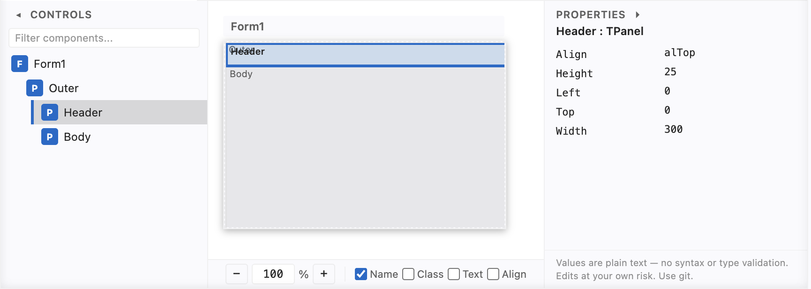

# Code4Delphi — Delphi Language Support for Visual Studio Code

<p align="center">
  
</p>

**Code4Delphi** — Modern, high-quality **Delphi / Object Pascal** language support for Visual Studio Code, covering the latest Delphi language features (through **Delphi 13.1** and all older versions back to Delphi 7), plus the code-navigation shortcuts Delphi developers expect from the RAD Studio IDE.

**Author:** Olaf Monien, Embarcadero MVP · [Developer Experts, LLC](https://www.developer-experts.net)

## Quick Info

**Syntax Highlighting**, **Familiar Keybindings** & **Form Layout** for **Delphi in Visual Studio Code** — out of the box:

| | |
| --- | --- |
| 🎨 **Syntax Highlighting** | Modern, high-quality **Delphi 13.1** syntax highlighting — all latest language features plus full support for older Delphi code, in `.pas`, `.pp`, `.dpr`, `.dpk`, `.inc`, `.p`, `.int` and form files (`.dfm` / `.fmx`). |
| ⌨️ **Familiar Keybindings** | The **Delphi IDE shortcuts you already know**: `Ctrl+Shift+↓` / `Ctrl+Alt+↓` → interface ↔ implementation, `Ctrl+Shift+↑` / `Ctrl+Alt+↑` → back to declaration, `Alt+↓` / `Alt+↑` → next / previous method. |
| 📐 **Form Layout Visualizer** | Open any `.dfm` / `.fmx` (or sibling `.pas`) and run **Code4Delphi: Show Form Layout** — box-model layout, control tree, Align simulation and text properties. Works on **Windows, Linux and macOS**. |

## Why Code4Delphi?

There are other Delphi extensions for Visual Studio Code — some of them are very
powerful, but they often bundle **complex additional features**: language servers,
project & build tooling, completion engines, dependency analyzers and more. That
is great when you need all of it — and heavy when you don't.

**Code4Delphi is deliberately lightweight:**

* 🎨 just excellent **syntax highlighting**,
* ⌨️ the **familiar Delphi keybindings** for fast code navigation, and
* 📐 a **form layout visualizer** for `.dfm` / `.fmx` —
* 🪶 **no Language Server (LSP)**, no build integration, no telemetry, **zero
  runtime dependencies**.

Instead of a language server — a separate process with its own runtime and
dependencies — Code4Delphi uses a **small, built-in static analyser** that runs
directly in the extension host. It is purely syntax-based (lexical) and needs
**no external components**: nothing to download, no server to start, no extra
memory beyond the document itself. That keeps the extension small, fast to
install, and instant to activate.

**Forms without the full IDE.** Opening a form or data module in the Delphi IDE
expects **every component package used on that form to be installed** in the IDE.
Missing design-time packages are a common blocker — especially when reviewing
legacy code, third-party forms, or AI-generated DFMs, and especially when you are
not on Windows. Code4Delphi’s visualizer shows **layout, hierarchy and text
properties** from the form file alone: lightweight, easy, and it works on
**macOS** (and Linux) as well as Windows.

It activates instantly and stays out of your way — the ideal companion when you
want to **read, review and inspect Delphi code**, for example code written by
**Claude or other AI agents**.

## Features

Code4Delphi brings the features Delphi developers know from the RAD Studio IDE
into Visual Studio Code:

1. **High-quality syntax highlighting** — a hand-crafted TextMate grammar that
   covers the complete **Delphi 13.1** language and every older version. Unit
   sections, class/record/interface declarations, generics, attributes,
   operator overloading, managed records and multi-line string literals are all
   colored precisely — in any theme. **`.dfm` / `.fmx` form files** get the
   same schemes (object hierarchy, properties, strings, numbers, collections).

2. **Delphi-IDE code navigation** — jump from an `interface` method declaration
   to its `implementation` (`Ctrl+Shift+↓`), back with `Ctrl+Shift+↑`, and step
   through methods with `Alt+↓` / `Alt+↑`. Navigation is **overload-aware**
   (parameter types are compared, so you always land on the right method) and
   understands classes, records, helpers, generics and global routines.

3. **Selectable color schemes** — four syntax schemes for Delphi code:
   **Fancy** (the vivid Code4Delphi look), **Turbo Pascal** (the classic IDE)
   and the authentic **Delphi Light** / **Delphi Dark** colors of Delphi 13.1.
   The default **`auto`** follows your VS Code light/dark theme. Only the
   Delphi highlighting changes — your global theme is never touched.

4. **Code folding** — fold unit sections, `begin…end` blocks, `{$REGION}` markers
   and conditional compiler directives (see below).

5. **Editor conveniences** — comment toggling for `//` and `{ }`, auto-closing
   brackets and strings (incl. multi-line `'''…'''` literals), and correct
   word selection for identifiers like `TMyClass_123`.

6. **Form layout visualizer** — box-model view of `.dfm` / `.fmx` with Align simulation (see below).

### 4. Code folding

A built-in folding provider for Delphi source (`.pas`, `.dpr`, …) supplies fold
ranges that work with VS Code’s gutter chevrons and fold commands:

| What folds | Markers / keywords | Setting |
| --- | --- | --- |
| **Unit sections** | `interface`, `implementation`, `initialization`, `finalization` | `delphi.folding.sections` |
| **Structural blocks** | `begin…end`, `case`, `try`, `record`, `class`, `object`, `asm` | `delphi.folding.beginEnd` |
| **Named regions** | `{$REGION}` … `{$ENDREGION}` (nested; optional label) | `delphi.folding.regions` |
| **Conditionals** | `{$IFDEF}` / `{$IFNDEF}` / `{$IF …}` … `{$ENDIF}` / `{$IFEND}` (nested; `{$ELSE}` stays inside one fold) | `delphi.folding.conditionals` |

`{$REGION}` folds are tagged as VS Code **region** folds, so **Fold All Regions** /
**Unfold All Regions** apply to them. All four kinds default to **on** and can be
disabled independently in settings.

### 5. Editor conveniences

* Comment toggling for `//` and `{ }`
* Auto-closing pairs for `()`, `[]`, `{}`, strings and multi-line strings
* Proper word boundaries (`TMyClass_123` selects as one word)

### 6. Form layout visualizer (DFM / FMX)

Open any `.dfm` or `.fmx` file (or a `.pas` that has a sibling form) and run
**Code4Delphi: Show Form Layout** (Command Palette, or the editor context menu
on Delphi / form files).

> **Not a design-time renderer.**  
> The visualizer deliberately does **not** try to paint real VCL/FMX controls.
> Doing that would require the **compiled design-time packages** for every
> component on the form — exactly the heavy, Windows-centric dependency this
> extension avoids. What you get instead is a **structural box model**: bounds,
> Align, ownership tree and text properties parsed from the form file. Enough to
> understand and edit layout without installing the full component set in an IDE.

<p align="center">
  
</p>

A three-pane webview shows the form as a **box model**:

| Pane | Role |
| --- | --- |
| **Controls** (left) | Hierarchy tree with live filter; click to select, double-click to jump to source. Collapsible. |
| **Layout** (center) | Title bar + nested rectangles + zoom bar (`−` / editable % / `+`) and label toggles. |
| **Properties** (right) | Text properties of the selection (editable). Collapsible. |

**Interaction**

* Click a box or tree node → select it; descendants are highlighted so ownership is obvious.
* Double-click a box or tree node → jump to the corresponding `object` line in the editor.
* **Escape** → select the parent control (ignored while typing in an editor field).
* **↑ / ↓** in the tree → move selection among visible (filtered) nodes.
* Label toggles at the bottom: **Name**, **Class**, **Text** (Caption/Text), **Align** — any combination, including none. Defaults come from settings (see below).
* Zoom from 25 % to 400 %; type a percentage and press Enter to apply.
* **PPI / PixelsPerInch** — if the form stores a design-time PPI, bounds are scaled to 96 DPI logical pixels for display (default 96 = 1:1).

**Property editing**

* Click a property value to edit inline; **Enter** or blur saves, **Escape** cancels.
* **…** opens an extended multi-line editor (useful for long captions / scripts).
* Values are treated as plain text (no type checking). Prefer version control.
* Delphi **`#xyz` string encoding** is handled on read/write:
  * Decode on load: `'J'#228'nner'` → `Jänner`
  * Encode on save: non-ASCII and control characters become `#n` codes
  * Line breaks are stored as **`#13#10`** on a single DFM source line  
    (e.g. `'Line1'#13#10'Line2'`), never as raw newlines in the file.

**Align simulation.** The visualizer does not only show the raw coordinates written in the file. It runs a lightweight layout pass that approximates Delphi’s Align behaviour:

| Framework | Behaviour |
| --- | --- |
| **VCL** (`.dfm`) | `alTop` / `alBottom` / `alLeft` / `alRight` stack along the edges; `alClient` fills the remaining client area. |
| **FMX** (`.fmx`) | Same edge rules, plus `MostTop` / `MostBottom` / `MostLeft` / `MostRight` (higher priority), `Contents` (fills the whole parent and overlaps), `Center` / `VertCenter` / `HorzCenter` / `Horizontal` / `Vertical`. `Scale` / `Fit*` are approximated as Client. |

Align is normalised (`alTop` → `Top`, etc.) and can be shown in box labels when the **Align** toggle is on.

The renderer is **pluggable**: `FormLayoutView` owns the shell (tree, inspector, selection, messaging) and delegates the drawing surface to a render provider (`IRenderProvider`). The current implementation (`DomRenderProvider`) uses nested absolutely positioned divs; a Canvas or SVG provider can be added by implementing `buildCss()` / `buildClientScript()`, without touching the parser or the view host.

## Configuration

Everything is configurable through settings (`Preferences → Settings → Extensions → Delphi`):

| Setting | Default | Description |
| --- | --- | --- |
| `delphi.navigation.enabled` | `true` | Master switch for all navigation keybindings. Turn it off to free the shortcuts for other extensions. |
| `delphi.navigation.goToImplementation` | `true` | Enable the “Go to Method Implementation” command and its shortcuts. |
| `delphi.navigation.goToDeclaration` | `true` | Enable the “Go to Method Declaration” command and its shortcuts. |
| `delphi.navigation.nextPreviousMethod` | `true` | Enable “Next/Previous Method” commands and their shortcuts. |
| `delphi.navigation.matchOverloads` | `true` | Use parameter types to disambiguate overloads when jumping. |
| `delphi.navigation.jumpToSection` | `true` | When the cursor is not on a method, jump between the `interface`/`implementation` section headers. |
| `delphi.navigation.showStatusMessage` | `false` | Show status-bar feedback on navigation. |
| `delphi.keybindings.style` | `default` | Keybinding style for the navigation commands: `default`, `emacs` or `wordstar`. |
| `delphi.colorScheme` | `auto` | Syntax color scheme for Delphi files only (global theme untouched): `auto` (follows your light/dark theme), `fancy`, `turboPascal`, `delphiDark`, `delphiLight` or `none`. |
| `delphi.folding.sections` | `true` | Fold the four unit sections (`interface` … `finalization`). |
| `delphi.folding.beginEnd` | `true` | Fold `begin…end`, `case`, `try`, `record` and `class` blocks. |
| `delphi.folding.regions` | `true` | Fold `{$REGION}` / `{$ENDREGION}` markers (VS Code region folds). |
| `delphi.folding.conditionals` | `true` | Fold `{$IFDEF}` / `{$IF}` / `{$IFNDEF}` … `{$ENDIF}` / `{$IFEND}`. |
| `delphi.formLayout.labels.showName` | `true` | Default: show component **Name** on boxes / title bar. |
| `delphi.formLayout.labels.showClassName` | `false` | Default: show **class name**. |
| `delphi.formLayout.labels.showCaption` | `false` | Default: show **Caption** / **Text**. |
| `delphi.formLayout.labels.showAlign` | `false` | Default: show **Align** (when not `None`). |

To change a shortcut, use `Preferences → Keyboard Shortcuts` and rebind `Delphi: Go to Method Implementation / Interface Section`, etc. (or edit `keybindings.json`).

## Requirements

* Visual Studio Code **1.80 or newer**. No runtime dependencies; works offline.

## Known limitations

* Syntax highlighting is a TextMate grammar, so it is purely lexical (no semantic type resolution) — like every other non-LSP Delphi extension.
* Interface ↔ implementation matching is heuristic and line-based; extremely unusual formatting (e.g. `procedure` on a different line than the method name) may not be recognised.
* Form layout visualizer:
  * Text DFM/FMX only (binary forms are not parsed).
  * Align simulation covers the common edge + Client cases well; it does **not** implement full FMX layout managers, per-control Margins/Padding, CustomAlign callbacks, or exact Fit/Scale aspect-ratio math.
  * Property edits are plain text (no type/syntax validation); multi-line string values are written as a single DFM line using `#13#10` character codes.
  * DFM source that splits one string across physical lines with trailing `+` is only partially supported for round-trip editing.
  * Non-visual components without size may be omitted from the drawing (they still appear in the tree).

## Development

```sh
npm install               # tests: vscode-textmate, vscode-oniguruma, Playwright
npm test                  # unit tests: parser/navigation + grammar + form layout + commands
npm run test:formLayout   # DFM/FMX parser, layout engine, webview host unit tests
npm run test:webview      # Playwright browser tests for the form-layout webview UI
npx playwright install chromium   # once, for test:webview
```

Press `F5` in VS Code to launch the Extension Development Host.

Marketplace publishing (publisher `DeveloperExperts`, PAT expiry, `vsce` commands) is documented in [`docs/publishing.md`](docs/publishing.md).

## License

MIT — see [LICENSE](LICENSE).

## Trademarks

Delphi and Embarcadero are trademarks or registered trademarks of Embarcadero Technologies, Inc. or its affiliates in the United States and/or other countries. All other trademarks are the property of their respective owners. This project is not affiliated with, endorsed by, or sponsored by Embarcadero Technologies, Inc.
